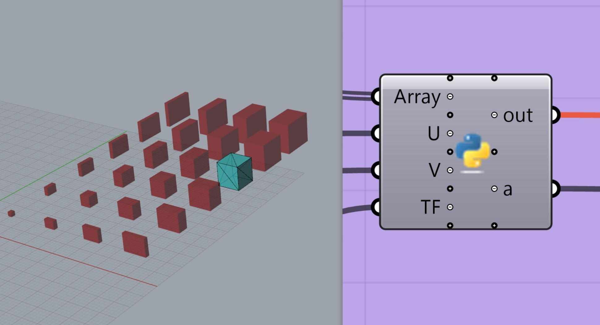

# GrasshopperBake-with-SerialNumber  




ユニークな部材を管理するために、連番で名前をつけてファイル書き出しをする。  
手でいちいち Bake して、名前を付けてなんてやるのは面倒なので、自動化させる。  

rs.Command() はめっちゃ便利。rhino と Grasshopper と Python のいいとこどりできる。  

- 実行環境    
  - windows10  
  - Rhinoceros5 (Win)  
  - Grasshopper (0.9.0076)  
  - ghPython (0.6.0.3)  


---  

### index

- GrasshopperBake-with-SerialNumber.ghx  

  - List-Bake   
    - K個のオブジェクトを、0 から K まで、連番で数字を振って STL ファイルに書き出し。  


  - Tree-Bake  
    - U x V 行列を、0_0 から U_V まで、ID を付けて STL ファイルに書き出し  

    ```Python
    num_1, num_2 = divmod(i, U)
    str_1 = str(num_1)
    str_2 = str(num_2)

    str_name = str_1 + "_" +str_2
    ```

- List-Bake   
  - 今回の 6x4 = 24で、0 ~ 24 の STL ファイル   

- Tree-Bake  
  - 今回の 6x4 = 24で、(0, 0) ~ (3, 5) の STL ファイル   


---


### ref  

- ~[ghpythonlib.componentsをつかってコンポーネント機能をpythonからコール](http://am.d-xx.com/2015/06/04/ghpythonlib-components%E3%82%92%E3%81%A4%E3%81%8B%E3%81%A3%E3%81%A6%E3%82%B3%E3%83%B3%E3%83%9D%E3%83%BC%E3%83%8D%E3%83%B3%E3%83%88%E6%A9%9F%E8%83%BD%E3%82%92python%E3%81%8B%E3%82%89%E3%82%B3%E3%83%BC/)~ （数十個くらいなら問題ないけど重くなるので）使ってません  
